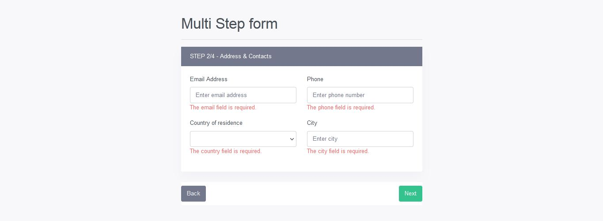

# Multi Step Form Using Livewire in Laravel

Laravel livewire is a user-friendly package for developing full-stack web applications; it lowers the pain of building dynamic user interface components. You are going to understand how to use this package to create a dynamic multi-step form with a laravel form wizard using livewire.
Forms are useful for collecting user information, Sometimes, you need to build advanced forms that need to be categorized in multi-steps. This tutorial will guide you from scratch about how to create a multi-step way not only but also form a wizard with the help of the livewire package in the laravel 8 application.

